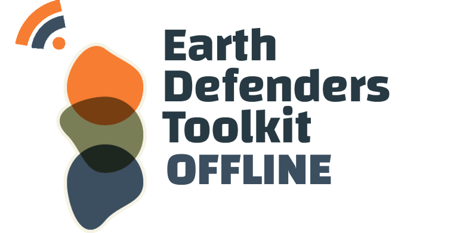
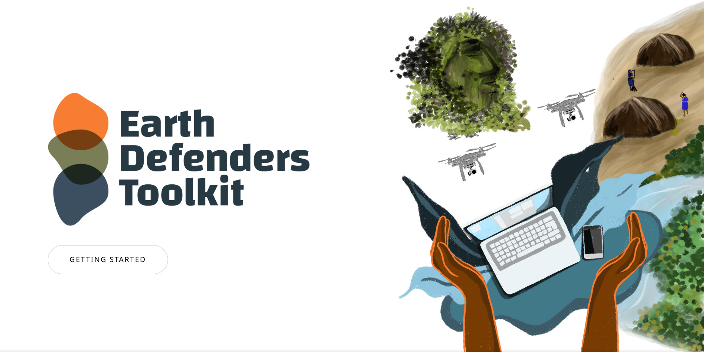
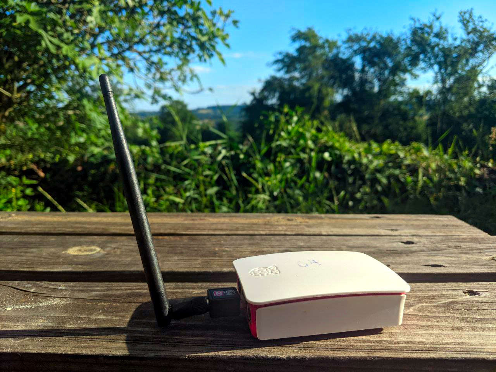
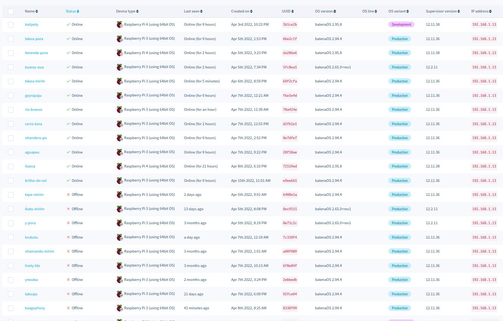

 
  

**EDT Offline** is a multi-device stack, which can be easily installed on single-board-computers, Nucs, or any recycled marchine. It creates an access point with the [Earth Defender's Toolkit](http://earthdefenderstoolkit.com/) platform running, even without the Internet. It provides applications, documentation, use cases, curated websites, and application bridges.

The software stack and content are automatically updated while online, and there are different strategies to update them while offline.

EDT offline provides full support for community mapping and land-based storytelling projects.

There's the possibility to cover more themes such as community archiving, communication, networking, radio, education and content streaming projects in the future.

*Raspberry Pi 3*

A team can easily monitor and give direct support to all devices (with granted consent) while online. The device can be temporarily transported to a place with connectivity or connected to a mobile hotspot in order to receive direct support.

*Balena Cloud dashboard showing devices running on more than 20 Guarani villages*

## Extending

- Create an accessible space for sharing and interacting with story maps with all generations by connecting a screen or a projector to the computer's hdmi and using input devices (mouse, controller, keyboard) to interact
- Support more simultaneous users and extend wifi range with a router
Extend the router's wifi range by setting up a mesh network with your neighbors